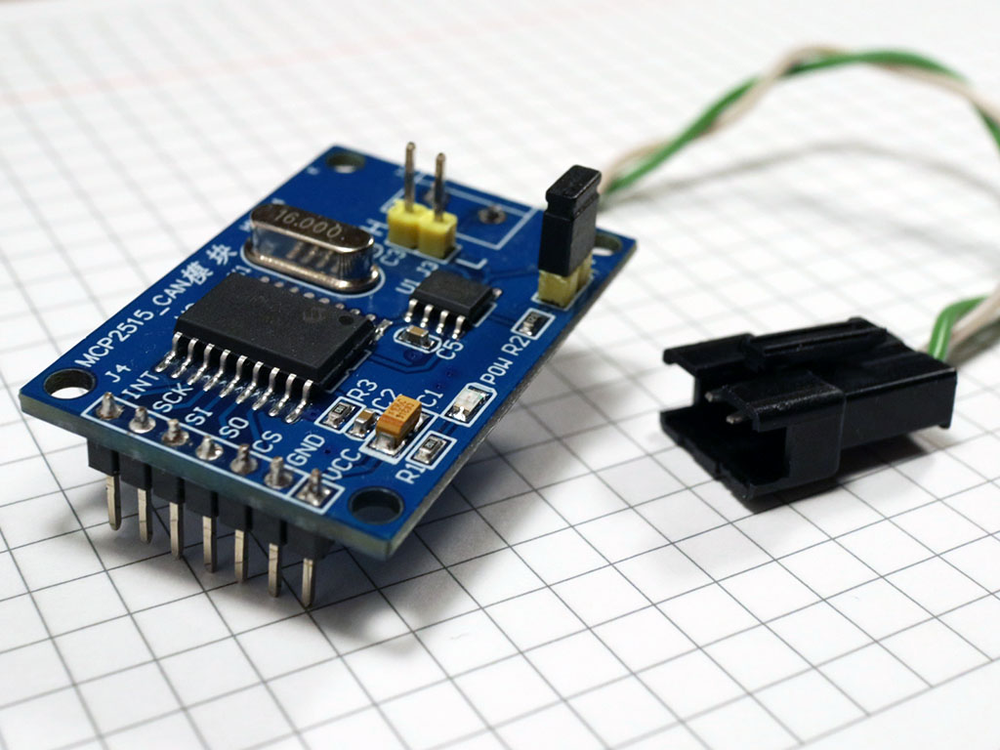
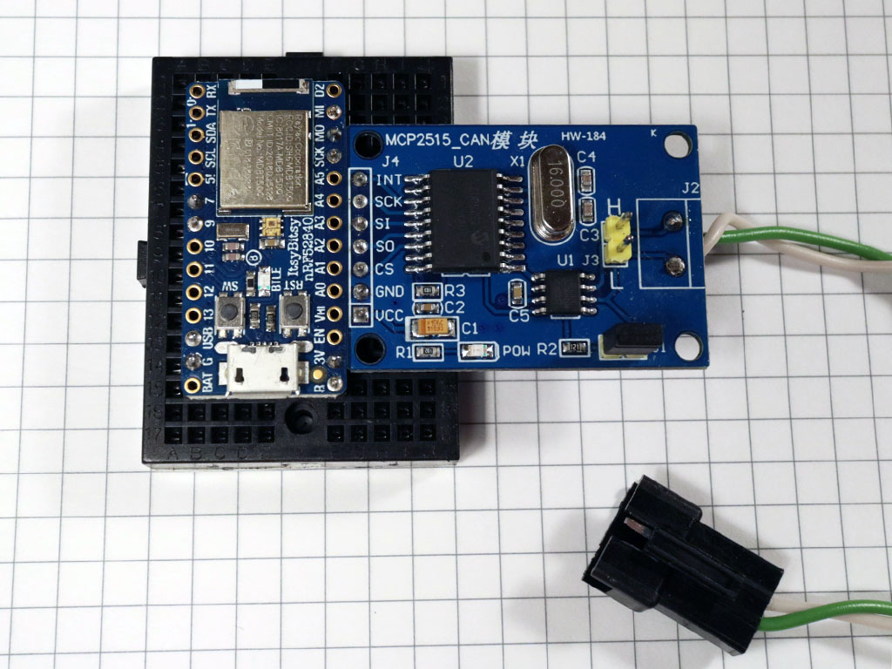

# RaceChronoDiyBleDevice
DIY BLE device for RaceChrono, currently supports reading data from the CAN bus.

[RaceChrono](https://racechrono.com/) is a lap timer app that supports
collecting all kinds of data: GPS, OBD-II, heart rate, etc.\
Most importantly for this project, it allows collecting high quality high
refresh rate data from the CAN bus of a car.

If you're lucky to have a car where the main CAN bus is available on pins 6 and
14 of the OBD-II port (such as 2013-2020 Subary BRZ, Scion FR-S, Toyota 86;
NC and ND generation Miatas), you can collect the data from the CAN bus using an
affordable OBDLink MX+ reader.

Some newer car cars (2022 Subaru BRZ and Toyota GR86, 2018+ Subaru WRX, many
Porsches) isolate the CAN bus from the OBD-II port, so you can only get slow and
limited data using the OBD-II protocol. However, if you can find an alternative
place to access the CAN bus, you can read data from there -- albeit you'll need
to do some custom connections.

This project documents how to make your own DIY device that can listen to the
data on the CAN bus of the car, and relay it to RaceChrono using Bluetooth Low
Energy (BLE). The code has customizations for my 2022 Toyota GR86, as well as a
2017 Subaru BRZ I used to own, but you should be able to un-do those
customizations and do something similar for your car if it's different from
those two.

## Demo

Here is a video I made in RaceChrono using the data acquired by RaceChrono from
a DIY CAN bus reader:

[](https://www.youtube.com/watch?v=R1ucTVodH9Q)

[Here](https://www.ft86club.com/forums/showthread.php?p=3347436#post3347436)
is a post with more info on how I got RaceChrono displayed on my headunit via
Android Auto.

## Safety disclaimer

CAN bus is like a "nervous system" in a car. It is a network that connects
various ECUs, sensors, etc. Connecting a new device to this network poses risks
such as data corruption, packet losses, etc., that can negatively affect the
performance of some or all components of a car. Same applies to incorrect
connections and alternations of the CAN bus wiring. This can cause various
undesirable effects, such as "Check engine" lights, electrical and mechanical
damage, loss of control, injuries and even death.

By using any information or code in this project you assume any and all risk,
and release any liability from the author(s) and contributors to this project.

## High level overview of the next steps

1. Assemble the CAN bus reader
2. Build and install the firmware
3. (Optional) Make sure everything works with another CAN device that sends
   "fake" data as your real car would.
4. Make a harness to connect the CAN bus reader to the CAN bus of your car
5. Connect the reader to your car and verify it actually works
6. Enjoy!

## Assembling the CAN bus reader

This section describes how to build the hardware for the CAN bus reader with a
JST SM connector. The connector can then be used to connect to a car-specific
harness for the CAN bus.

Recommended parts list:

* [Adafruit ItsyBitsy nRF52840 Express](https://www.adafruit.com/product/4481)
* [MCP2515 boards](https://www.amazon.com/gp/product/B07J9KZ4L4/) (2+ pcs recommended so you can test without a car)
* [16 MHz quarz oscillators](https://www.amazon.com/gp/product/B00NQ82OM0/) (in case your MCPs have 8 MHz quartzes)
* [Jumper](https://www.sparkfun.com/products/9044) (in case your MCP comes without it, like mine)
* [Mini Breadboard](https://www.sparkfun.com/products/12047)
* [Jumper wires](https://www.sparkfun.com/products/124)
* [JST SM connectors](https://www.amazon.com/gp/product/B07QG2TN1X/)
* Crimping tool for JST connectors
* ~22 AWG wires

First, solder the male headers to your microcontroller board.
You'll need G, 3V, SCK, MO, MI and 7.
It's also recommended to solder 9, R and USB for future improvements and
mechanical stability on the breadboard.
Soldering male headers is a lot easier if you first insert them into a
breadboard.

Put the jumpers on the breadboard this way to allow for neat hidden
connections:


Then, put the microcontroller board on the breadboard:


Un-solder the header from the MCP board and solder a new header on the other
side of the board to make it more breadboard-friendly.

Replace the 8 MHz quartzes on your MCPs with 16 MHz quartzes, if needed.
Optionally, un-solder the screw terminal and solder a twisted pair of wires to
the board, and finish with a nice JST SM connector:



I suggest using a white cable for CAN L and a colored cable for CAN H.
If you use a consistent color scheme for these wires and for the harness you use
in your car, it will be easier to make sure you get the polarity right.

Finally, put the MCP on the breadboard.



Check connections:

MCP pin | Microcontroller pin
------- | ------------------
VCC | 3V
GND | G
CS | 7
SO | MI
SI | MO
SCK | SCK
INT | Currently unused, may use 9 in the future

Optionally, put everything into a nice enclosure, but make sure to keep the
twisted pair with the JST connector available, as well as the USB port for power
and programming.

## Building and installing the firmware

You will need to install two Arduino libraries before you can build the project:
```sh
cd ~/Documents/Arduino/libraries/  # ~/Arduino/libraries on Mac OS
git clone https://github.com/timurrrr/arduino-CAN CAN
git clone https://github.com/timurrrr/arduino-RaceChrono arduino-RaceChrono
```

It's important that you don't use the arduino-CAN library available in the
Arduino IDE built-in library manager, as it has multiple bugs, and many
operations are implemented in an ineffective way. My pull requests to address
those have not been reviewed at the time of writing.

Once everything is set up, compile and upload the `RaceChronoDiyBleDevice.ino`
"sketch" using Arduino IDE.

## Testing with a "fake car"

It's a good idea to do some basic tests with another CAN device that sends data
over a CAN bus that's similar to what a real car would send.

See the
[FakeSubaruBRZ example](https://github.com/timurrrr/arduino-CAN/tree/master/examples/FakeSubaruBRZ)
in my fork of the `arduino-CAN` library that sends data over a CAN bus in a way
very similar to what a real 2017 Subaru BRZ would send.

TODO: write another example for a 2022 GR86/BRZ.

Once you assemble that device and install its firmware, connect the CAN reader
with the CAN end of the "fake car" via a twisted pair.
You will probably need to use a 120 Ohm resistor on the second board.

For these tests you'll probably find it easier to power the CAN reader via USB
from your computer/laptop, and maybe watch the "Serial monitor" in Arduino IDE
to diagnose issues.

## Making the CAN reader ready to work with your car

This particular project was designed for FT86 cars (Subaru BRZ,
Toyota 86/GT86/GR86, Scion FR-S). You can search for "BRZ" in the source code to
see where the customizations were made, and tweak to work better with your car.

If you do have an FT86 car, you might want to read

* [This page](can_db/ft86_gen2.md) for 2022 model year cars
* [This page](can_db/ft86.md) for 2013-2020 model year cars

on how to make a harness between the CAN bus and the reader, as well as how to
set up data channels in RaceChrono.

Some information about the CAN data has been documented for Mazda MX-5/Miata
([NC generation](can_db/mazda_mx5_nc.md) and
[ND generation](can_db/mazda_mx5_nd.md)).

If you know how to make physical connections, CAN IDs and equations for other
popular track cars, feel free to send a pull request!

It might be nice to make the software customizations programmable via a mobile
app and store the preferences in the flash storage of the nRF52840, but
currently this has not been implemented to keep the code minimalistic and easier
to read.

## Final steps

When you're sure that you've assembled everything correctly and basic tests pass
on your table top with a "fake car" device, it's time to put things into the
car. Here's how the final setup looked like in my 2017 Subaru BRZ:


If you have reliability issues with the CAN bus, try installing a jumper to
connect the 120 Ohm terminal resistor in parallel to the CAN chip.

At this point you may want to either power the device from a nearby 12V socket
via 12V-to-USB adapter and a USB cable, or upgrade your harness to also provide
12V ACC power and GND besides CAN H/L, and find a place for a 12V->5V step down
/ buck converter.

TODO: document how to use 12V ACC power to power the board.

## Contributions

I'd be happy to add more info on the CAN protocol for other popular sport cars.
Feel free to send pull requests!

## Support the project

I hope you found this project useful, entertaining, educating, etc.
Personally, I was amazed that for just ~$50 it's possible to get a data logging
system comparable to the "go to" devices that HPDE enthusasts use that cost 10x+
more. And since the "brain" of such a data acquisition system is RaceChrono, you
don't need to fiddle with cables, laptops, etc. to review your data when you
come back to the pits between sessions.

Having said that, I've spent a few too many evenings on this project, and this
is not my paid job. I have some more exciting ideas on how to further improve
this project, make it more accessible, support more car models... but can't
justify spending too much more time on it. If you want to thank me for what I've
already shared, or support my future ideas, I will appreciate it if you send me
some "boba tea money".

Here's a PayPal shortcut for your convenience:

[](https://www.paypal.com/donate?business=ZKULAWZFJKCES&item_name=Donation+to+support+the+RaceChronoDiyBleDevice+project&currency_code=USD)
